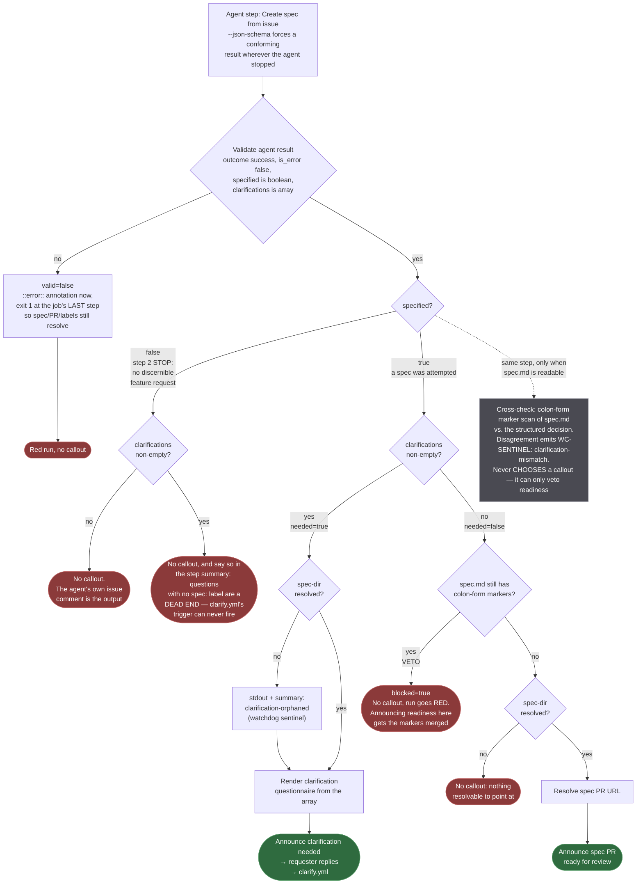

# Contract: Per-Stage Decision-Point Migration

This is the per-stage migration contract for spec 032 — every existing
grep-decision site FR-003/FR-004/FR-011 covers, its current behavior, and
its new structured-output-decides shape. `contracts/clarification-schema.md`
defines the schema and render algorithm this file's steps consume;
`contracts/watchdog-sentinel.md` defines the sentinel-set addition FR-012
depends on. `wing-commander-callout`'s own interface
(`.github/actions/wing-commander-callout/action.yml`) is unchanged by this
feature — every row below keeps its existing invocation shape, only the
`if:` condition and the `body-file:` content's origin change.

## `intake.yml`

| Step (current name) | Current behavior | New behavior |
|---|---|---|
| "Create spec from issue" (agent step) | Step 7 instructs the agent to write `## Question N` prose to `${{ runner.temp }}/intake-clarification.md` when markers remain, or nothing otherwise | Gains `--json-schema` (intake schema, `contracts/clarification-schema.md`); step 7 instructs the agent to return `{specified: true, clarifications}` instead of writing a file, and step 2's STOP path is instructed to return `{specified: false, clarifications: []}` |
| "Check whether the spec still needs clarification" (`id: clarification`) | `grep -q '\[NEEDS CLARIFICATION' "$SPEC_DIR/spec.md"` → `needed=true\|false`, gated on a discoverable spec dir | Reads back the agent step's structured result (`contracts/clarification-schema.md`'s read-back idiom); `needed` = `specified == true AND clarifications non-empty`. Gated on `valid == 'true'` instead of on a discoverable spec dir — the decision no longer reads `spec.md`, and skipping it when the branch push failed would silently drop an authored questionnaire. Publishes `specified` as a second output. Runs the colon-form cross-check against post-agent `spec.md` when a spec dir exists; on mismatch, writes the `clarification-mismatch` line to stdout AND `$GITHUB_STEP_SUMMARY`; when questions exist but no spec dir was resolved, writes `clarification-orphaned` the same way. `needed` is decided ONLY by the structured result (FR-004) |
| *(new)* "Render clarification questionnaire" | — | New step, gated on `needed == 'true'`: renders `${{ runner.temp }}/intake-clarification.md` from the structured `clarifications` array per `contracts/clarification-schema.md`'s render algorithm, replacing the file the agent used to author itself |
| "Announce clarification needed" | `if: steps.clarification.outputs.needed == 'true'`, `body-file: ${{ runner.temp }}/intake-clarification.md` | Unchanged invocation shape; `if:` condition unchanged (still keys off `needed`); the file it reads is now deterministically rendered, not agent-authored. `needed` folding in `specified` is what keeps this callout off the step 2 STOP path, where no `spec:` label exists and a reply could never reach the clarify loop |
| "Announce spec PR ready for review" | `if: steps.clarification.outputs.needed == 'false'` | Still the negation of the same `needed` output, so it can never be suppressed by an independently-computed condition (closing the #159 mutual-exclusivity failure mode); `&& steps.clarification.outputs.specified == 'true' && steps.created.outputs.spec-dir != ''` is added because `needed == 'false'` is also true on the no-spec path. Both extra conjuncts are required and neither implies the other: `specified` excludes the step 2 STOP (where a stale `spec-draft/NNN-*` branch from an earlier run could otherwise be mistaken for this run's output), `spec-dir` excludes an attempted spec whose branch is not discoverable. `"Resolve spec PR URL"` carries the identical condition |
| "Fail on agent API error" → "Validate agent result" + "Fail on invalid agent result" | Checks `steps.agent.outcome == 'success'` and a non-empty `.result.is_error` sentinel | Extended per `contracts/clarification-schema.md`'s validation-failure contract: a `success` step outcome whose terminal result is missing the required `clarifications` key, or fails schema validation, is also a failure (FR-002). Split in two so intake's side effects survive a dropped result: "Validate agent result" runs before the clarification step (so it can never read a coerced empty array), emits the `::error::` and publishes `valid`, exiting 0; the job's last step turns `valid != 'true'` into `exit 1`, after "Resolve created spec" and "Label spec PR to match the issue" have run |

## `clarify.yml`

| Step (current name) | Current behavior | New behavior |
|---|---|---|
| "Fold answers into the draft spec" (agent step) | Step 6 instructs the agent to write to `${{ runner.temp }}/clarify-followup.md`: which questions were resolved, or the still-open questions if markers remain; step 2's early-STOP path posts its own `gh issue comment` and writes no file | Gains `--json-schema` (clarify schema, `contracts/clarification-schema.md`); step 6 instructs the agent to return `{answered, clarifications}` instead of writing a file; step 2's early-STOP path is unchanged (FR-014) except its "STOP" now additionally means "return `answered: false, clarifications: []`" rather than "write no file" |
| "Determine clarification follow-up outcome" (`id: clarification`) | `[ ! -f "$followup" ]` → `none`; else grep on post-edit `spec.md` → `needs-clarification` / `ready` | Reads back the structured result. `answered == false` → `outcome=none` (no cross-check run — `research.md`'s scope decision). `answered == true`: `outcome` = `needs-clarification` / `ready` from `clarifications` emptiness; cross-check runs here, **behind the same `[ -n "$SPEC_DIR" ] && [ -f "$SPEC_DIR/spec.md" ]` existence guard intake uses** (without it an unreadable `spec.md` yields `marker=false` and a spurious mismatch on every run that legitimately has open questions), and writes `WC-SENTINEL: clarification-mismatch` to stdout AND `$GITHUB_STEP_SUMMARY` on disagreement. In the dangerous direction it also sets `blocked=true` |
| *(new)* "Render clarification questionnaire" | — | New step, gated on `outcome == 'needs-clarification'`: renders `${{ runner.temp }}/clarify-followup.md` from the structured `clarifications` array (same render algorithm as intake's; the "which questions were resolved" narrative line the agent used to write is dropped — the rendered block lists only the still-open questions, matching what row 3 already posts today per `specs/019-next-step-callouts/contracts/callout-points.md` row 3) |
| "Announce remaining clarification questions" | `if: steps.clarification.outputs.outcome == 'needs-clarification'`, `body-file: ${{ runner.temp }}/clarify-followup.md` | Unchanged invocation shape and `if:` condition; file content now deterministically rendered |
| "Announce spec PR ready for review" | `if: steps.clarification.outputs.outcome == 'ready'`, `body-file: ${{ runner.temp }}/clarify-followup.md` (a "which questions were resolved" summary) | `if:` gains `&& steps.clarification.outputs.blocked != 'true'` (the cross-check veto — see Contract clauses; `"Resolve spec PR URL"` carries the identical condition), otherwise unchanged. `body-file:` becomes optional/omitted when `clarifications` is empty and there is no resolved-questions narrative to show — OR retains a short deterministic "all clarification questions are resolved" line if the call site still wants body content; either choice is a rendering detail `tasks.md` may finalize, NOT a decision-branch change (FR-011: this callout must never be suppressed by the questionnaire branch, and both outcomes here derive from the same `answered`/`clarifications` read, never from an independent condition) |
| "Fail on agent API error" | Same shape as `intake.yml`'s | Same extension as `intake.yml`'s row above, applied to the clarify schema's required keys (`answered`, `clarifications`). NOT split like intake's — but the reason is narrower than first recorded. It is **not** that clarify has no side effects: by this point the agent has already folded the answers into `spec.md`, committed, pushed, and rewritten the PR body. Those are UPSTREAM of the gate, so failing in place cannot strand them; intake's split exists because intake has *remaining steps* ("Resolve created spec", "Label spec PR to match the issue") whose work would be skipped, leaving an unlabeled orphan PR. Clarify has none. The residue is user-facing rather than repo-state — the requester sees only the 👀 reaction, so a further reply re-enters clarify against questions already resolved — which the `::error::` now names explicitly ("the fold may ALREADY be committed and pushed... check the PR before re-running") along with the shape actually received |

## Contract clauses

- Every `if:` condition in both tables above keys off a single upstream
  output (`needed` for intake, `outcome` for clarify) that is itself
  derived from ONE structured-output read, never from two independently
  computed conditions — this is the structural fix for #159 (mutually
  exclusive branches computed from disagreeing sources can no longer arise,
  because there is only one source).
- The colon-form marker cross-check (`contracts/clarification-schema.md`)
  runs in the SAME step that computes `needed`/`outcome`, immediately after
  the structured-output read, so the mismatch warning and the branch
  decision are always evaluated against the identical snapshot of
  `spec.md`. It is skipped — never the step around it — when no spec
  directory was resolved, since only the cross-check reads a file.
- No step in either table gains `Write`/`Edit` in its `--allowedTools` — the
  render step is a `run:` (bash/jq) step, not an agent step, and needs none.
- No step in either table changes `wing-commander-callout`'s own interface
  or any other existing label mutation (`spec:<slug>`, `stage:spec` in
  intake; none in clarify) — those stay exactly as they are today.
- **Every callout in this table must be reachable when it fires.** A callout
  that instructs the requester to reply, posted on an issue whose labels
  cannot satisfy `wing-commander-2-clarify.yml`'s trigger (`spec:` plus
  `stage:spec|clarify`), is a dead end — worse than silence, because it
  claims an affordance that does not exist. This is why intake's
  questionnaire branch folds in `specified` rather than testing `spec-dir`:
  see the flow below and `research.md`'s corrected schema decision.
- **Every callout must also be honest when it fires.** "Review the spec PR"
  asserts the spec is ready. The cross-check therefore holds a **veto**: in
  the one dangerous direction of disagreement — the structured result reports
  no open questions while `spec.md` still carries colon-form
  `[NEEDS CLARIFICATION:` markers — the decision step sets `blocked=true`,
  both readiness steps are suppressed, and a final step fails the run.
  Without it, an agent that followed prompt step 3 (which tells it to leave
  the markers in place) but returned `clarifications: []` got a readiness
  callout, and whoever merged that PR merged the markers with it. The
  opposite direction (questions returned, no markers) stays warn-only: the
  questions are real and answerable.

  A veto is **not** a third branch, and it does not reopen #159. The
  cross-check still never chooses a callout and never synthesizes a question
  from marker text (FR-004, FR-007) — `needed`/`outcome` remain the single
  source deciding *which* callout fires, derived from one read of the
  structured result. The veto can only take the "ready" claim off the table
  and turn the run red, which is a strictly smaller power than voting.
- Sites explicitly **not** in this table: `intake.yml`'s "Post
  excluded-comments notice" (spec 029, unrelated condition). Step 2's "issue
  does not contain a discernible feature request" early-exit **is** affected
  by this feature, contrary to this contract's original text: it now returns
  `specified: false`, which is what keeps the questionnaire branch off it.
  The original claim — that the path was "gated out before a spec directory
  exists" — described the pre-032 workflow, where the decision step itself
  carried `steps.created.outputs.spec-dir != ''`. This feature removed that
  guard from the decision (deliberately, so a failed push cannot swallow an
  authored questionnaire) and the claim did not survive the change.

## Flow: how intake decides what to post

Read top to bottom; every diamond is a condition that literally appears in
`intake.yml`. `specified` and `clarifications` come from the agent's
schema-validated terminal result; `spec-dir` is the deterministic
`git ls-remote` read-back in "Resolve created spec".

### What each gate buys

| Gate | Without it |
|---|---|
| `valid == 'true'` on the decision step | A dropped or malformed terminal result reads as an empty `clarifications` array — "intake ran fine and found nothing to ask" — and the run stays green (FR-002) |
| `specified` folded into `needed` | The step 2 STOP path posts "Answer the open clarification questions" on an issue with no `spec:` label. `wing-commander-2-clarify.yml` never fires on the reply; the requester is told to act and cannot |
| `specified == 'true'` on the spec-PR arm | A stale `spec-draft/NNN-*` branch left by an earlier run makes intake announce a spec PR for a spec this run never wrote |
| `spec-dir != ''` on the spec-PR arm **only** | Announcing a spec PR that does not exist. Note it is deliberately **absent** from the questionnaire arm — putting it there would drop an authored questionnaire whenever the branch push failed, which is the silent loss this feature exists to remove |
| Both posting callouts keyed off one output | The #159 failure mode: two independently computed conditions disagreeing, so both arms fire or neither does |
| `blocked` veto on the readiness arm | An agent that leaves `[NEEDS CLARIFICATION:` markers in the committed `spec.md` (which prompt step 3 tells it to do) while returning `clarifications: []` gets "Review the spec PR" announced, and the markers merge with it |
| The existence guard on the cross-check | A missing or unreadable `spec.md` makes `grep` fail, `marker=false`, and every run that legitimately has open questions reports a spurious mismatch — the cross-check crying wolf about its own inability to read the file |
| Emitting `WC-SENTINEL: <token>`, not a bare word | The collector caps bare-word sentinels at one match per job (`grep -Eim1`), and `denied` — which the intake prompt coaches the agent to discuss — appears earlier in the log than the clarification steps, masking them permanently (`contracts/watchdog-sentinel.md`) |
| That token on stdout, not just the summary | The watchdog's scan reads job logs; `$GITHUB_STEP_SUMMARY` is never mirrored into them, so a summary-only write is invisible to it |
| `blank`, not `//`, on optional render fields | `//` falls through on null and false only, so a schema-permitted `context: ""` renders a bare `**Context**:` line and `implications: ""` an empty table cell, inside a callout posted to a human |

### Regression coverage

`.github/scripts/verify-clarification-gating.py` (lint-workflows.yml Gate 8)
executes the shipped decision shell against synthetic agent transcripts and
evaluates the shipped `if:` expressions against the outputs it really
produces, asserting the fired-callout set for every path in the flow above —
including the invariant that the two posting callouts are mutually
exclusive. It ends with a mutation check that strips the `specified` guard
back out and asserts the suite fails, so the suite cannot rot into
decoration.
